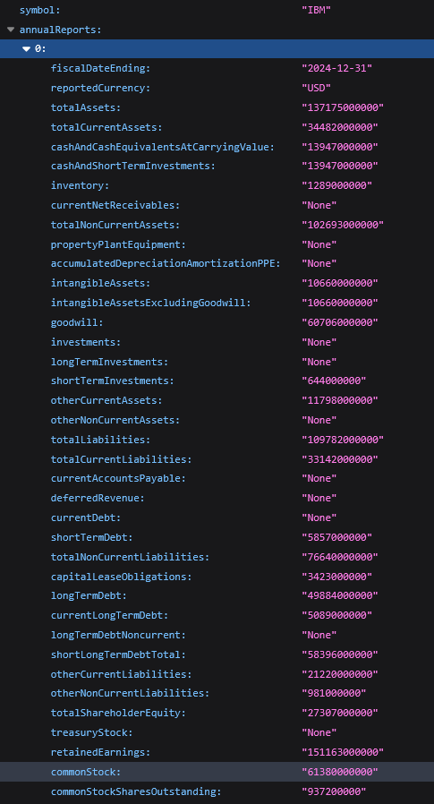
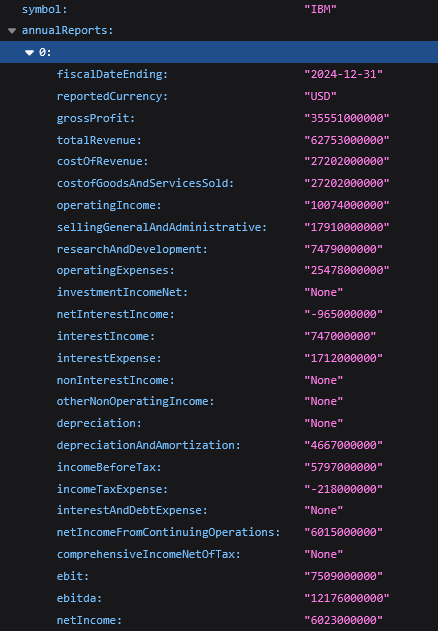

# S&P 500 Valuation Multiples: Statistical Analysis of Trading Multiple Pricing 
### Project Outline

This is a data analysis project inspired by NYU Stern Business School Prof. Aswath Damodaran from his Valuations course. It is a relative valuation method built upon traditional comparable companies analysis. It is based upon Discounted Cash Flow (DCF) calculations to derive Enterprise Value (EV) using metrics like Weighted Average Cost of Capital (WACC), Reinvestment Rate (RIR), Expected Growth Rate Etc. These financial metrics represent independent variables for dependent variable EV, as such, it allows the opportunity for a linear regression study to interpret the performances of companies relative to their industry peers. The regressed line would serve as a projection tool built on the performance of the industry, and thus, it presents the concept of under/over-pricing for companies as their current financial metrics are projected forward. A possible strategy to this analysis insight would be long companies where theoretical trading mulitple are greater than its current value and short companies whose theoretical trading mulitple are projected to decrease. 

The project utilises AlphaVantage API to gather financial data from companies listed in the S&P 500 index. The data includes annual and quarterly Income Statement and Balance Sheet information which are stored in a PostgreSQL database for efficient data management and analysis. The project implements a caching system to track processing progress and avoid redundant API calls, making it resilient to interruptions and mindful of API rate limits. The SP500 CSV data is sourced from Kaggle in late 2024 and consolidate with a few data points published by Prof. Aswath.

---
 

## Execution

The project is broken into three distinct stages to tackle specific goals of the project. The first stage involve the creation and configuration of the database, as it is the base to which the requested data are stored. A function execute requests through API keys to append the data points accordingly. The next stage involve the bulk of the project operation where financial data are used to compute metrics, placed through statistical tests and a regression model, plotted 3-dimensionally for visualisation, and stored additionaly into the database. It is a long automated pipeline that processes industries within the S&P 500 index to produce the crucial data points we are aiming for. The last stage focuses on visualising the derived data points and validifying their models from the statistical tests. It aims to be present a company and its peer industry like a comparable companies analysis output page with an added focus on the theoretical EV trading multiples.

---

### Program 1: Data Retrival from Alpha Vantage API and Storage to Local PostgreSQL Database

To maximise the efficiency of data gathering and reducing the redundancy of API calls, Program 1 implements a robust data retrieval and storage system. The program first initializes a PostgreSQL database with a comprehensive schema designed to store company information, financial reports, and various metrics. Key features include:

1. **Database Schema**:
   - Companies table for storing basic company information including sector and industry classification
   - Industries table containing sector-specific metrics like cost of capital and growth rates
   - ReportingPeriods table to track fiscal periods
   - FinancialReports and FinancialData tables for storing the actual financial data
   - Additional tables for calculated metrics and regression analysis results

2. **Data Processing**:
   - Processes companies by industry groups (small: <6 companies, medium: 6-12 companies, large: >12 companies)
   - Implements a caching system to track progress and resume interrupted processing
   - Handles both annual and quarterly reports with configurable limits
   - Includes robust error handling and logging

3. **API Integration**:
   - Manages API rate limits with configurable delays between calls
   - Processes both Balance Sheet and Income Statement data
   - Validates and transforms data before storage

The data structure retrieved from AlphaVantage follows a standardized JSON format, with separate endpoints for Balance Sheet and Income Statement data shown below. The program processes this data and stores it in a normalized database structure for efficient querying and analysis.

  
  

  <b>Figure 1:</b> Example Balance Sheet data | <b>Figure 2:</b> Example Income Statement data

---

### Program 2: Database Requests, Metric Calculations, and Regression Analysis

Program 2 focuses on retrieving the stored financial data and performing complex calculations to derive various financial metrics and conduct regression analysis. The program features:

1. **Financial Metrics Calculation**:
   - Computes key metrics including:
     - Working Capital and Net Working Capital changes
     - Revenue Growth and Operating Margins
     - EBITDA and related margins
     - Reinvestment Rate and Return on Invested Capital
     - Expected Growth rates and Beta calculations

2. **Industry Analysis**:
   - Processes companies within their industry groups
   - Calculates industry-specific metrics and benchmarks
   - Incorporates industry-level cost of capital and reinvestment rates

3. **Regression Analysis**:
   - Performs statistical analysis on various EV multiples
   - Conducts diagnostic tests including:
     - Heteroscedasticity testing (Breusch-Pagan)
     - Multicollinearity analysis (VIF)
     - Normality checks on residuals
   - Generates confidence intervals and statistical significance measures

4. **Data Storage**:
   - Stores calculated metrics in dedicated tables
   - Maintains regression results including coefficients, diagnostics, and visualizations
   - Preserves analysis history for trending and comparison

---

### Stage 3: SQL Queries, Data Visualisation, and Statistical Validation

---
 

## EV Multiples and Financial Metric Methodology

This section describes how EV multiples are calculated using company financial metrics. An intrinsic DCF framework is applied to approximate the relationship between financial ratios and EV multiples. Project limitations are discussed, focusing on assumptions and generalizations necessary for large-scale S&P 500 analysis.

### Fundamental DCF-Based Approach

- EV is estimated using Free Cash Flow to Firm (FCFF), WACC, and Growth Rate:

$$ EV = \frac{FCFF}{WACC - Growth\ Rate} $$

- FCFF is derived as:

$$ FCFF = EBIT \times (1 - Tax\ Rate) \times (1 - RIR) $$

---

### Key Financial Metrics Used

| Metric | Notation | Formula |
|--------|----------|---------|
| Revenue Growth Rate | **Rev. Growth** | $\left( 1 - \frac{Current\ Revenue}{Previous\ Revenue} \right) $|
| After-Tax Operating Margin | **ATOM** | $\( EBIT \times (1 - Tax\ Rate) \)$ |
| Reinvestment Rate | **RIR** | $\left( \frac{Free\ Cash\ Flow}{ATOM} \right)$ |
| Sales to Capital | **SC** | $\left( \frac{Sales}{Capital\ Invested} \right)$ |
| Return on Invested Capital | **ROIC** | $\( ATOM \times Sales\ to\ Capital \)$ |
| Percentage D&A | **DA%** | $\left( \frac{DA}{EBITDA} \right)$ |
| Expected Growth Rate | **Exp. Growth** | $\( RIR \times ROIC \)$ |
| Industry WACC | **IWACC** | Industry Average WACC |
| Industry Reinvestment Rate | **IRIR** | Industry Average RIR |

---

### EV/EBIT Derivation Example

- Rearranging DCF terms leads to:

$$ \frac{EV}{EBIT} = \frac{(1 - Tax\ Rate) \times (1 - RIR)}{WACC - Growth\ Rate} $$

- EV/EBIT multiple is a function of Tax Rate, WACC, and Growth Rate.
- Similar logic applies to derive relationships for other EV multiples.

---

### Two-Stage DCF Extension

- To account for growth and terminal value, a two-stage DCF logic is applied:

$$
\frac{EV}{Metric} = Scaling\ Factor \times \left[\frac{(1 - RIR)(1 + Rev.\ Growth)\left(1 - \frac{(1 + Rev.\ Growth)^t}{(1 + WACC)^t}\right)}{WACC - Rev.\ Growth} + \frac{(1 - IRIR)(1 + Rev.\ Growth)^t(1 + Exp.\ Growth)}{(IWACC - Exp.\ Growth)(1 + WACC)^t}\right]
$$

- \( t \) represents the number of projection years.

| EV Metric | Scaling Factor | Proof |
|-----------|----------------|-------|
| EV/EBIT | \( 1/(1 - tax) \) |  |
| EV/EBIT(1-Tax) | 1 | EBIT(1-tax)/EBIT(1-tax) |
| EV/EBITDA | \( (1 - DA\%) (1 - tax) \) | \( EBIT(1-tax) = (EBITDA - DA)(1-tax) \) |
| EV/Sales | ATOM | \( EBIT(1-tax)/Sales = ATOM \) |
| EV/Capital Invested | ROIC | \( EBIT(1-tax) = ROIC \times IC \) |

---

## Limitations

Several limitations affect this large-scale EV multiple estimation:

---

### 1. Assumptions of the Model

- A uniform 3-year projection is assumed across companies, balancing growth and maturity.
- Growth, reinvestment rates, and expected growth are approximated using 3-year historical averages.
- Using backward-looking averages introduces bias, particularly for extreme events (e.g., COVID-19 pandemic).
- Terminal values use industry average WACC and RIR but retain company-specific 3-year expected growth.

---

### 2. WACC Calculation Simplifications

- WACC is based on average market risk premiums and credit default risks rather than firm-specific data.
- Ideal WACC calculation requires:
  - Specific credit ratings (e.g., S&P, Moody's, Fitch)
  - Accurate ERP per firm's operational market
- Due to data access limitations, WACC generalizations assume companies operate primarily in U.S. markets.

WACC formula:

$$
WACC = Cost\ of\ Debt \times (1 - Tax\ Rate) \times \left(\frac{Debt}{Debt+Equity}\right) + Cost\ of\ Equity \times \left(1 - \frac{Debt}{Debt+Equity}\right)
$$

where:

$$
Cost\ of\ Debt = Riskfree\ Rate + Credit\ Default\ Risk
$$

and

$$
Cost\ of\ Equity = Riskfree\ Rate + Levered\ Beta \times Equity\ Risk\ Premium
$$

---

### 3. Industry Variables and External Sources

- Industry averages for WACC, unlevered beta, and RIR are sourced from Prof. Aswath Damodaran.
- Individual company differences are not captured, which may lead to generalization bias.
- Collecting firm-specific betas, capital structures, and reinvestment behaviors was out of project scope.

---
 

## Statistics Technicals

The statistical analysis framework employs multiple regression diagnostics to ensure the robustness and validity of our EV multiple predictions. Each regression model undergoes four key diagnostic tests, with specific thresholds determining the reliability of the results.

### Regression Diagnostics

1. **Heteroscedasticity Testing**:
   - Implements Breusch-Pagan test to check for constant variance in residuals
   - Null hypothesis: Homoscedasticity exists (constant variance)
   - Test threshold: p-value > 0.05 indicates passing condition
   - Critical for ensuring unbiased coefficient estimates

2. **Multicollinearity Assessment**:
   - Utilizes Variance Inflation Factor (VIF) for each predictor
   - VIF threshold: < 5.0 for all independent variables
   - Tests independence between:
     - Return On Invested Capital & Revenue Growth (EV/EBIT)
     - Return On Invested Capital & Operating Margin (EV/After Tax EBIT)
     - Return On Invested Capital & DA (EV/EBITDA)
     - Operating Margin & Revenue Growth (EV/Sales)
     - Return On Invested Capital & Expected Growth (EV/Capital Invested)

3. **Normality Testing**:
   - Examines standardized residuals for normal distribution
   - Calculates mean absolute standardized residuals
   - Threshold: Mean absolute value < 2.0
   - Important for valid confidence interval estimation

4. **Linearity Assessment**:
   - Employs Ramsey RESET test for linear relationship validity
   - Tests against quadratic terms of fitted values
   - Passing condition: p-value > 0.05
   - Essential for regression model specification

### Confidence Interval Construction

The model implements linear confidence intervals for regression predictions using:

$$ CI = \hat{y} \pm t_{\alpha/2,df} \times \sqrt{MSE \times (1 + x_i^T(X^TX)^{-1}x_i)} $$

where:
- $\hat{y}$ is the predicted value
- $t_{\alpha/2,df}$ is the t-distribution critical value
- MSE is the mean squared error
- $x_i^T(X^TX)^{-1}x_i$ accounts for prediction variance

Key parameters:
- Confidence level: 90% (adjustable parameter)
- Degrees of freedom: n - k - 1 (n: observations, k: predictors)
- Surface visualization: Main regression plane with upper/lower CI bounds

### Model Evaluation Metrics

Each regression analysis captures comprehensive model performance statistics:

1. **Goodness of Fit**:
   - R² (coefficient of determination)
   - Adjusted R² (accounts for model complexity)
   - AIC (Akaike Information Criterion)
   - BIC (Bayesian Information Criterion)

2. **Statistical Significance**:
   - F-statistic and corresponding p-value
   - Individual t-statistics for coefficients
   - Standard errors for parameter estimates

3. **Theoretical Value Calculation**:
   For each EV multiple, theoretical values are computed using:
   
   $$ Theoretical = \beta_0 + \beta_1X_1 + \beta_2X_2 $$
   
   where:
   - $\beta_0$ is the y-intercept
   - $\beta_1, \beta_2$ are predictor coefficients
   - $X_1, X_2$ are the respective financial metrics

### Visualization Framework

The analysis employs 3D visualization techniques to represent:

1. **Surface Plot**:
   - Regression plane showing predicted relationships
   - Color gradient indicating prediction magnitude
   - Mesh grid density: 100 x 100 points

2. **Confidence Bounds**:
   - Semi-transparent surfaces showing 90% CI
   - Linear uncertainty bands across prediction space
   - Buffer ratio: 10% for axis extensions

3. **Data Points**:
   - Actual observations plotted as scattered points
   - Color-coded by prediction accuracy
   - Size: 100 units with edge highlighting

The statistical framework ensures robust analysis across different industry sectors while maintaining interpretability through comprehensive visualization and diagnostics.

--- 

### Financial Context of Regression Models

Each EV multiple regression analyzes specific financial relationships:

1. **EV/EBIT Model**:
   - Predictors: ROIC and Revenue Growth
   - Financial Interpretation:
     - ROIC measures operational efficiency in generating profits from invested capital
     - Revenue Growth captures company's market expansion and scale potential
     - Heteroscedasticity here would indicate varying prediction reliability across different company sizes
     - High VIF would suggest redundancy between operational efficiency and growth metrics

2. **EV/After Tax EBIT Model**:
   - Predictors: ROIC and After Tax Operating Margin
   - Financial Interpretation:
     - ROIC represents capital efficiency
     - After Tax Operating Margin shows true operational profitability
     - Normality violations might indicate industry-specific tax treatment effects
     - Non-linearity could suggest diminishing returns in operational efficiency

3. **EV/EBITDA Model**:
   - Predictors: ROIC and DA%
   - Financial Interpretation:
     - ROIC maintains focus on operational efficiency
     - DA% captures capital intensity and reinvestment needs
     - Heteroscedasticity might indicate varying reliability across capital-intensive vs. light industries
     - Multicollinearity would suggest overlapping information between efficiency and capital intensity

4. **EV/Sales Model**:
   - Predictors: After Tax Operating Margin and Revenue Growth
   - Financial Interpretation:
     - Operating Margin shows pricing power and cost control
     - Revenue Growth indicates market penetration
     - Non-linearity could reveal scaling effects in different growth phases
     - Residual patterns might show industry-specific margin-growth trade-offs

5. **EV/Capital Invested Model**:
   - Predictors: ROIC and Expected Growth
   - Financial Interpretation:
     - ROIC shows current capital efficiency
     - Expected Growth represents future value creation potential
     - Heteroscedasticity might indicate varying reliability across growth stages
     - High VIF could suggest current efficiency predicting future growth

### Diagnostic Implications for Financial Analysis

1. **Heteroscedasticity Impact**:
   - Higher variance in larger companies could indicate size-related risk factors
   - Industry-specific volatility patterns might suggest structural differences
   - Market cycle effects on prediction reliability
   - Capital structure influence on valuation stability

2. **Multicollinearity Considerations**:
   - Strong ROIC-Growth correlation might indicate sustainable competitive advantages
   - Margin-Growth relationships could reveal industry maturity stage
   - Operating leverage effects on multiple relationships
   - Capital intensity influence on operational metrics

3. **Normality Implications**:
   - Skewed residuals might indicate industry transformation phases
   - Outliers could represent companies with unique business models
   - Heavy tails might suggest higher frequency of extreme valuations
   - Industry consolidation effects on valuation distribution

4. **Linearity Context**:
   - Non-linear relationships might indicate:
     - Economies of scale effects
     - Market saturation points
     - Competitive dynamics changes
     - Industry lifecycle stages

---
 

## References
To be added....
